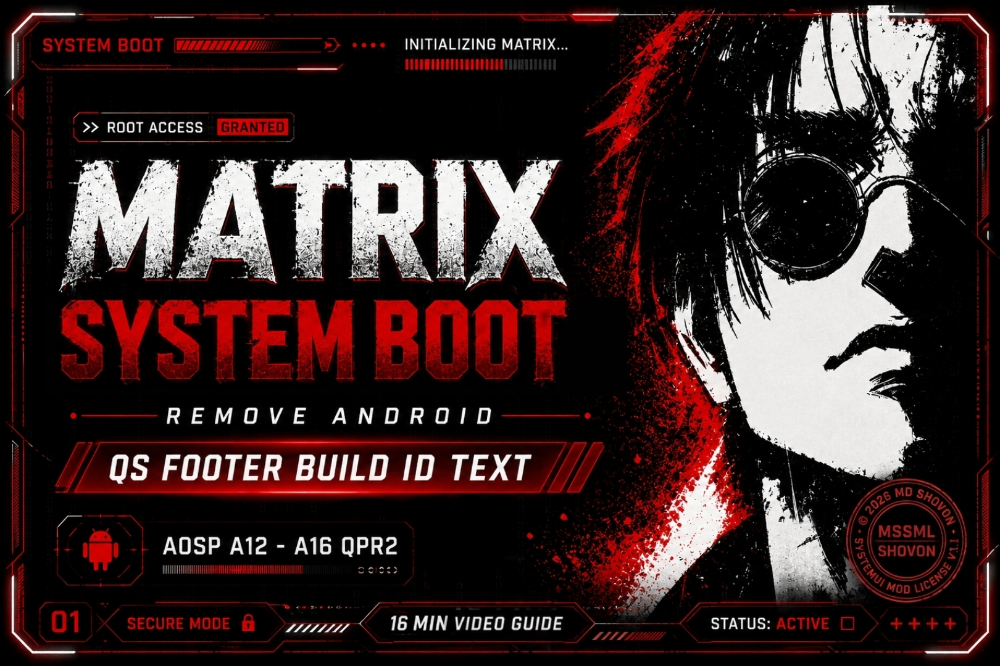
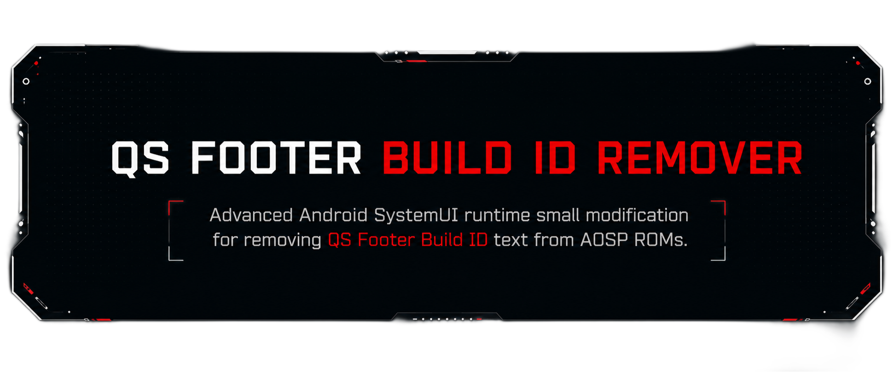
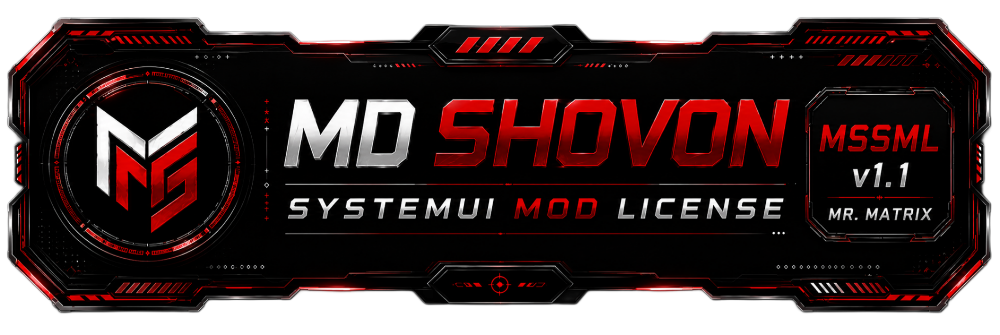

<div align="center">

</div>

<p align="center">

</p>

<div align="center">


<div align="center">

</div>

<div align="center">

</div>

<div align="center">

</div>

<div align="left">

</div>

<table align="left">
<tr>
<td align="left">
<div align="left">

</div>

</td>
<td align="left">

<div align="left">

</div>


</td>
</tr>
</table>

<br clear="left"/>

<div align="center">

</div>

<div align="center">


<br>
<a href="https://drive.google.com/file/d/1RmnqVLj7OcPUXbx0bZnTiQ_T_-4UruUX/view?usp=drivesdk">


</a>
</div>

<div align="center">

</div>

<div align="left">

</div>

<div align="left">
    
```console
The author of this build, as well as developer MD Shovon,
are not responsible for any possible damage, malfunctions,
device bricking, or data loss caused by using this modification.
Use this modification completely at your own risk.
Before performing any actions, please back up your
SystemUI.apk using any method you are comfortable with.

```

<div align="left">

</div>

<div align="left">

```txt
The most important thing to do is to use your brain and valuable time to work deeply.
```

<div align="left">

</div>

```smali
.method public final setBuildText()V
    .locals 0

    return-void
.end method
```
<div align="left">

</div>

```console
1. ApkTool M
2. MT Mananger
3. Termux (Optional)
```
<a href="https://t.me/shovonxos/20">

</a>

</div>

```diff
+ RENAME MT Manager.bin FILE TO .apk FORMAT
```

<div align="center">

</div>

<div align="center">

</div>

<div align="center">

</div>

<div align="center">


</div>
