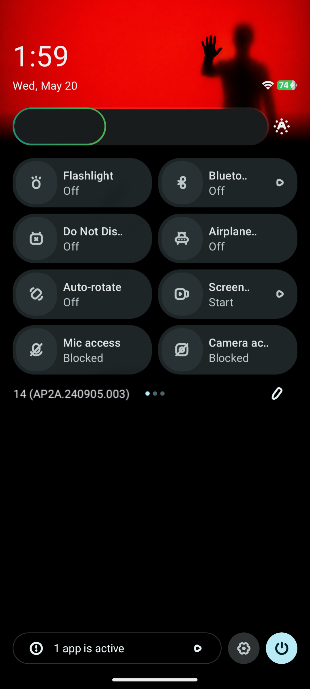
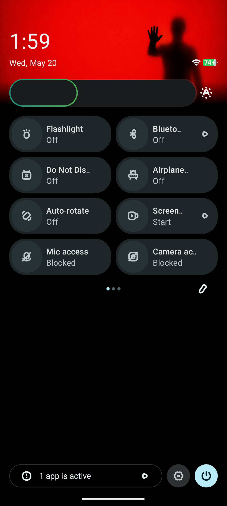

# MATRIX SYSTEM BOOT
## QS Footer Build ID Remover

SystemUI smali modification guide for removing
QS Footer Build ID text from AOSP-based ROMs.

---

# Preview

## Before


## After


---

# About This Research

This project demonstrates how to remove the
QS Footer Build ID text from Android SystemUI.

Target smali path:

```txt
com/android/systemui/qs/QSFooterView.smali
```

This implementation was researched and authored by MD SHOVON.

---

# Why Overlay Cannot Do This

Normal Runtime Resource Overlays (RRO) can only modify:

- strings
- dimens
- layouts
- drawables
- bools
- integers

RRO cannot:

- modify smali methods
- override runtime execution flow
- inject logic
- bypass conditional checks
- replace Java/Kotlin implementation

Because of these limitations,
this modification requires direct smali editing.

---

# Main Target Method

```smali
.method public final setBuildText()V
    .locals 0

    return-void
.end method
```

Replace all instructions between:

```txt
.line 349 → .line 714
```

with the implementation above.

---

# Main File Location

```txt
SystemUI_src/smali/com/android/systemui/qs/QSFooterView.smali
```

---

# Compatibility

Supported ROMs:

- AOSP
- LineageOS
- PixelOS

Supported Android versions:

- Android 12
- Android 13
- Android 14
- Android 15
- Android 16 QPR2

---

# Video Guide

Full 16-minute implementation guide:

```txt
resources/16-min-video-guide.txt
```

---

# Warning

This modification affects live SystemUI runtime behavior.

A mistake may cause:

- SystemUI crash
- bootloop
- instability
- data loss

Backup SystemUI.apk before modification.

USE AT YOUR OWN RISK.

---

# License

Licensed under:

MD SHOVON SYSTEMUI MOD LICENSE (MSSML) v1.1

See:

```txt
LICENSE.txt
```

---

# Credits

Original SystemUI modification by MD SHOVON

MR MATRIX • SHOVON X OS